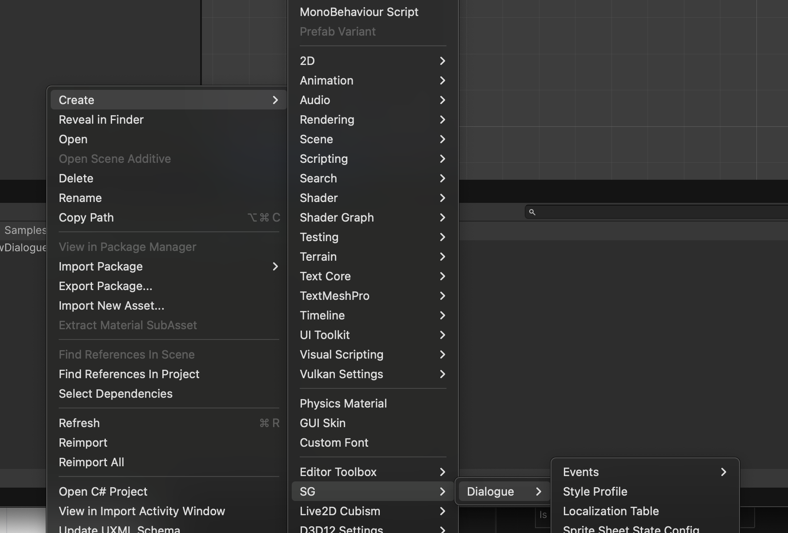
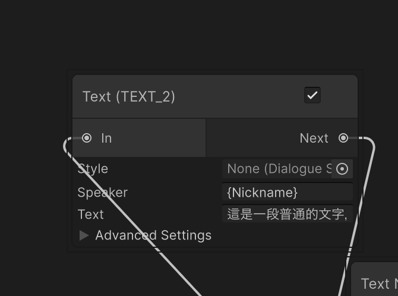
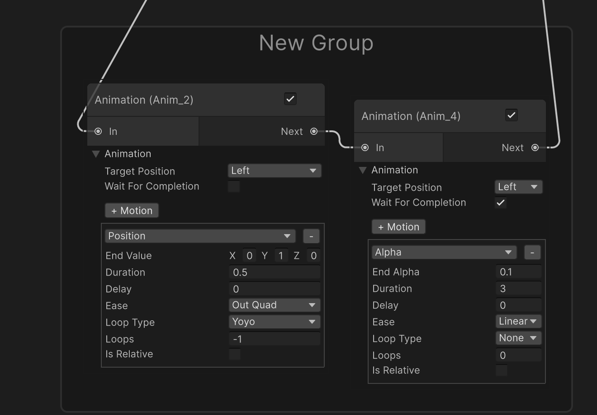

# SG Dialogue System (com.sg.dialogue) 使用手冊

歡迎使用 SG Dialogue System！本文件將引導您了解系統的核心概念、安裝與設定、使用方法，以及進階整合技巧。

本系統是一個為 Unity 設計的、基於節點且具「時間軸式演出」概念的對話系統。其核心設計重點是：**以事件通道 (Event Channels) 解耦對話與遊戲系統**，讓敘事工作流能在低耦合、高擴充的前提下穩定成長。

---

## 🔗 快速連結 (Quick Links)

*   **快速入門**：跳到「[快速入門](#2-快速入門你的第一個對話)」
*   **節點參考**：跳到「[節點參考](#3-節點參考手冊)」
*   **第三方整合**：跳到「[第三方整合](#46-第三方整合)」
*   **疑難排解**：跳到「[疑難排解](#6-疑難排解-troubleshooting)」

---

## ✅ 環境需求 (Requirements)

*   **Unity**：2022.3+
*   **TextMeshPro**：本系統的文字顯示與文字動畫功能依賴 TMP。
*   **相依套件 (Required Dependencies)**：請先在專案中安裝（通常透過 UPM Git URL）：
    *   LitMotion
    *   LitMotion.Animation
    *   Unity-Editor-Toolbox
    *   NuGetForUnity

### 可選整合 (Optional Integrations)

*   **Live2D**：安裝 Live2D Cubism SDK，並加入 Scripting Define Symbol：`LIVE2D_KIT_AVAILABLE`
*   **Spine**：安裝 Spine-Unity Runtime，並加入 Scripting Define Symbol：`SPINE_KIT_AVAILABLE`

> 若缺少可選整合的 SDK 或 define symbol，系統仍可正常運作；對應 Render Mode / 功能只是不會顯示。

---

## 🧩 安裝與基本設定 (Installation & Setup)

### 安裝方式

*   透過 UPM 安裝 package 後，建議先讓 Unity 重新編譯並確認 Console 無錯誤。
*   若此 package 是以範例專案/子模組形式存在於你的專案中，可略過安裝步驟。

### 匯入範例 (推薦)

你可以從 Package Manager 匯入範例來最快上手（名稱可能因版本略有不同）：

*   `Window > Package Manager` → 選取 **SG Dialogue System** → `Samples` → Import

### 最小運作配置（概念）

至少會需要：

1.  一個 `DialogueGraph`（對話內容資產）
2.  一個全域狀態資產（用於跨對話的變數/旗標）
3.  場景內一個 `DialogueController` 用來執行對話圖

此外，若你要讓 Audio / Particle / GameEvent 等節點真的「產生效果」，場景中也必須有**對應的 Manager/Receiver 訂閱相同的事件通道資產**（詳見「[事件通道架構](#41-事件通道架構-event-channel-architecture)」）。

---

## 📚 名詞對照 (Terminology)

*   **DialogueGraph（對話圖）**：`ScriptableObject` 資產，描述節點與流程。
*   **DialogueController（對話控制器）**：場景中的 `MonoBehaviour`，負責讀取 Graph 並逐一執行節點。
*   **Node（節點）**：流程中的一個具體動作（顯示文字、播放音效、角色動作等）。
*   **Port（連接埠）**：節點之間的流程連線入口/出口（例如 `In`, `Next`, `If`, `Else`）。
*   **Event Channel（事件通道）**：用 `ScriptableObject` 承載的事件發布/訂閱管道，實現與遊戲系統解耦。

---

## 1. 核心概念

本系統旨在成為一個基於節點、時間軸式的、可擴充的對話編輯工具。其核心設計理念是讓敘事設計師能夠以最少的程式碼，創作出複雜、動態且具有電影感的對話演出。

*   **DialogueGraph (對話圖)**: 一個 `ScriptableObject` 資產，是所有對話的藍圖。它作用類似於「演出時間軸」，包含一系列定義了對話流程與事件的節點。
*   **DialogueController (對話控制器)**: 場景中的一個 `MonoBehaviour`，扮演「導演」的角色。它會讀取一個 `DialogueGraph` 並逐一執行其中的節點，同時協調各個管理器（如 UI、視覺、音訊）。
*   **Nodes (節點)**: 每一個節點都是序列中的一個獨立、具體的動作（例如：顯示文字、讓角色登場、播放音樂）。透過連接這些節點，您可以創造出一場複雜的演出。
*   **事件通道 (Event Channels)**: 系統的核心設計模式之一。節點（如 `PlayAudioNode`）不直接呼叫管理器，而是透過 `ScriptableObject` 事件通道發送請求。這使得對話系統與遊戲的其他部分完全解耦。

---

## 2. 快速入門：你的第一個對話

請依照以下步驟來建立並執行您的第一個對話序列。

### 步驟 1: 建立核心資產

1.  **建立對話圖**: 在 Project 視窗中，點擊右鍵並選擇 `Create > SG/Dialogue > Dialogue Graph`。將它命名為 `CH1_Intro_Graph`。
2.  **建立全域狀態資產**: 同樣地，選擇 `Create > SG/Dialogue > Dialogue State Asset`。將它命名為 `Global_GameState`。這個檔案將用來儲存跨對話的變數（例如：玩家聲望、任務旗標）。

### 步驟 2: 開啟並設定編輯器

1.  從頂部選單，導航至 `SG/Dialogue > Graph + Localization Window` 以開啟主編輯視窗。
2.  在「Graph」分頁中，將您剛建立的 `CH1_Intro_Graph` 和 `Global_GameState` 拖曳到對應的物件欄位中。

### 步驟 3: 編排對話流

1.  **建立節點**: 在灰色的網格上點擊右鍵，開啟快捷選單。
    *   選擇 `Visual > Character Action`。
    *   選擇 `Text & Narrative > Text Node`。
2.  **設定節點**:
    *   **CharacterActionNode**: 將 `Action Type` 設為 `Enter`，`Position` 設為 `Center`，並指定一個角色圖片。
    *   **TextNode**: 將 `Speaker Name` 設為「英雄」，`Text` 設為「哈囉，世界！」。
3.  **連接節點**: 從 `CharacterActionNode` 的「Next」輸出口點擊並拖曳，連接到 `TextNode` 的「In」輸入口。
4.  **設定開始節點**: 在 `CharacterActionNode` 上點擊右鍵，選擇 `Set as Start Node`。該節點的邊框會變為綠色，表示它是對話的入口。

### 步驟 4: 在場景中執行

1.  **設定控制器**:
    *   在您的場景中，建立一個空的 GameObject 並命名為 `DialogueSystem`。
    *   將 `DialogueController` 元件加入到這個物件上。
    *   將您的 `CH1_Intro_Graph` 和 `Global_GameState` 拖曳到 `DialogueController` 對應的欄位。
2.  **觸發對話**: 要開始對話，您需要在某個腳本中取得 `DialogueController` 的引用，並呼叫 `controller.StartDialogue()`。

> **最小觸發範例 (Minimal Trigger)**：您可以建立一個簡單的觸發腳本來立即開始對話：
> ```csharp
> public class DialogueTrigger : MonoBehaviour
> {
>     public DialogueController controller;
>     void Start() { if (controller != null) controller.StartDialogue(); }
> }
> ```

現在，執行遊戲，您應該會看到您的第一個對話成功演出！

---

## 3. 節點參考手冊

本章節將詳細介紹各個節點的功能與用途。

### 3.1 文字與敘事 (Text & Narrative)

#### Text Node
*   **功能**: 顯示一段對話文字。這是最核心的節點。
*   **屬性**:
    *   `Speaker Name`: 說話者的名字。
    *   `Text`: 要顯示的對話內容。支援使用 `{變數名}` 來動態插入變數，以及使用動畫標籤（詳見「文字動畫」章節）。
    *   `Auto Advance`: 是否在顯示完畢後自動前進到下一個節點。

#### Choice Node
*   **功能**: 向玩家呈現多個選項，並根據玩家的選擇，將流程導向不同的分支。
*   **屬性**:
    *   `Choices`: 一個選項列表，每個選項包含 `Text` (選項文字) 和一個輸出口 (Port)。

#### Stage Text Node
*   **功能**: 顯示非對話性質的文字，例如場景描述、旁白或螢幕中央的提示。
*   **屬性**:
    *   `Text`: 要顯示的文字內容。
    *   `Display Time`: 文字顯示的持續時間。

### 3.2 流程控制 (Flow Control)

#### Condition Node
*   **功能**: 根據一個或多個變數的狀態來決定對話的走向，實現分支邏輯。
*   **屬性**:
    *   `Conditions`: 一個條件列表，每個條件包含要檢查的變數、比較方式 (如等於、大於) 和目標值。
    *   提供 `If` (條件成立) 和 `Else` (條件不成立) 兩個輸出口。

#### Wait Node
*   **功能**: 暫停對話流程一段指定的時間。常用於控制演出節奏。
*   **屬性**:
    *   `Wait Time`: 等待的秒數。

#### Parallel Node
*   **功能**: 將流程分岔為多個同時執行的分支。所有分支都執行完畢後，才會前進到下一個節點。適用於需要同時觸發多個獨立事件的場合 (如：一個角色說話的同時，另一個角色做動作)。

#### Sequence Node
*   **功能**: 將多個節點打包成一個可重複使用的序列。可以簡化複雜的圖表結構。

### 3.3 角色與視覺 (Character & Visuals)

#### Character Action Node
*   **功能**: 控制角色的所有視覺表現，是演出的核心。
*   **屬性**:
    *   `Action Type`: 執行的動作，如 `Enter` (登場), `Exit` (退場)。
    *   `Render Mode`: 渲染模式，支援 `Sprite`, `Live2D`, `Spine`, `SpriteSheet`。
    *   `Duration`: 淡入/淡出持續時間。
    *   其他屬性會根據 `Render Mode` 動態變化。

#### Animation Node
*   **功能**: 播放指定物件 (不一定是角色) 的 LitMotion 動畫。
*   **屬性**:
    *   `Target`: 要播放動畫的 GameObject。
    *   `Motions`: 動畫資料列表。

#### Set Background Node
*   **功能**: 更換場景的背景圖片。
*   **屬性**:
    *   `Background Sprite`: 新的背景圖片。
    *   `Fade Duration`: 漸變的持續時間。

### 3.4 攝影機與特效 (Camera & Effects)

#### Camera Control Node
*   **功能**: 控制主攝影機的行為，營造電影感。
*   **屬性**:
    *   `Action Type`: 執行的動作，如 `Move To` (移動到目標), `Zoom` (縮放), `Shake` (震動), `Follow` (跟隨目標)。
    *   其他屬性會根據 `Action Type` 動態變化。

#### Particle Node
*   **功能**: 播放或停止粒子特效。
*   **屬性**:
    *   `Event Channel`: 指定用於發送請求的 `ParticleEvent` 通道。
    *   `Action Type`: `Play` (播放) 或 `Stop` (停止)。
    *   `ParticleID`: 用於識別和停止特定粒子的唯一 ID。
    *   `ParticlePrefab`: 要播放的粒子 Prefab (僅 Play 模式)。
    *   `Position`: 粒子在世界空間中的位置。可透過 "Edit Position in Scene" 按鈕在場景中視覺化編輯。

#### Screen Effect Node
*   **功能**: 觸發一個通用的螢幕後期處理特效。

#### Flash / Flicker / Blur Effect Node
*   **功能**: 觸發特定的內建螢幕特效，如閃光、閃爍或模糊。
*   **屬性**:
    *   `Duration`: 特效持續時間。
    *   `Intensity`: 特效強度。

### 3.5 遊戲整合 (Game Integration)

#### Game Event Node
*   **功能**: 觸發一個在遊戲邏輯中定義的全域事件。這是實現對話系統與遊戲玩法解耦的關鍵。
*   **屬性**:
    *   `Event Channel`: 指定用於發送請求的 `GameEvent` 通道。
    *   `Request`: 包含 `EventName` 和 `Parameters` 的事件請求資料。

#### Play Audio Node
*   **功能**: 播放背景音樂 (BGM) 或音效 (SFX)。
*   **屬性**:
    *   `Event Channel`: 指定用於發送請求的 `AudioEvent` 通道。
    *   `Action Type`: `PlayBGM`, `StopBGM`, `PlaySFX`。
    *   `SoundName`: 要播放的音訊名稱 (Key)。

### 3.6 除錯 (Debugging)

#### Log Node
*   **功能**: 在 Unity 主控台印出一條訊息。主要用於在不中斷遊戲的情況下除錯對話流程或變數狀態。
*   **屬性**:
    *   `Message`: 要印出的訊息內容。

---

## 4. 進階主題與最佳實踐

### 4.1 事件通道架構 (Event Channel Architecture)

`GameEventNode`, `PlayAudioNode`, `ParticleNode` 是將對話與遊戲玩法深度整合的關鍵。它們都採用了「事件通道」設計模式。

*   **優點**: **解耦**。您的敘事團隊可以專心編寫故事，而不需要知道程式設計師是如何實現「開門」、「播放特定音樂」或「觸發下雨特效」的。他們只需要在正確的時機，透過正確的通道，發送正確的請求即可。
*   **設定方法**:
    1.  在 Project 視窗中，建立一個事件通道資產 (如 `AudioChannel`, `GameEventChannel`)。
    2.  在場景中，建立一個對應的管理器 (如 `DialogueAudioManager`, `DialogueParticleManager`)，並將通道資產指派給它。
    3.  在對話圖中，將同一個通道資產指派給對應的節點 (如 `PlayAudioNode`, `ParticleNode`)。

### 4.2 文字動畫 (Text Animator)

本系統內建一個 `DialogueTextAnimator`，可以為 TextMeshPro 文字添加即時頂點動畫。

*   **使用方法**:
    1.  確保您的對話 UI 文字物件上掛載了 `DialogueTextAnimator` 組件。
    2.  在 `TextNode` 的文字中，使用自定義標籤來包裹要產生動畫的文字。
*   **支援標籤**:
    *   `&lt;shake&gt;...&lt;/shake&gt;`: 使文字產生震動效果。
*   **範例**: "這太&lt;shake&gt;不可思議&lt;/shake&gt;了！"

### 4.3 視覺化編輯 (Visual Editing)

為了提升編輯效率，部分節點支援在 Scene View 中進行視覺化編輯。

*   **ParticleNode**: 當 `Action Type` 為 `Play` 時，節點上會出現一個 **"Edit Position in Scene"** 按鈕。點擊後，場景中會出現一個可供拖曳的 Dummy 物件，其位置會即時同步回節點的 `Position` 欄位。

### 4.4 變數系統

#### 全域變數 vs. 局部變數

*   **全域變數 (`GlobalStateAsset`)**: 用於儲存需要**長期保留**、**跨場景**或**需要被存檔**的狀態 (如：好感度、任務旗標)。
*   **局部變數 (Local Variables)**: 用於儲存**僅在當前對話中**有意義的臨時狀態，對話結束後會被清除。

> **使用語法**: 在任何節點的文字欄位中，使用 `{變數名}` 的格式來引用變數。在 `ConditionNode` 中，直接輸入變數名稱即可。

#### 外部變數解析：資料提供者模式

有時，您需要在對話中顯示不儲存在對話系統內部的資料（如玩家名稱、等級）。本系統提供了一個「資料提供者模式」的框架來實現此功能。

1.  **實現 `IVariableDataProvider` 介面**: 讓任何類別都能成為資料來源。
2.  **註冊資料提供者**: 在 `PlayerVariableResolver` 中註冊您的資料提供者。
3.  **擴充 `RuntimeDataProvider.cs`**: 這是擴充自訂變數的**唯一需要修改的地方**。在 `Awake()` 方法中，將您的遊戲資料映射到對話系統可以使用的變數名稱。
    ```csharp
    // RuntimeDataProvider.cs
    private void Awake()
    {
        // Key 是在對話中使用的名稱，Value 是一個返回目前值的函式。
        _dataMappings["PlayerName"] = () => PlayerProfile.PlayerName;
        _dataMappings["PlayerLevel"] = () => YourGameManager.Instance.PlayerLevel.ToString();
    }
    ```

### 4.5 開發者工具

*   **圖表驗證 (Validate Graph)**: 在「Localization」分頁中，使用「**Validate Graph**」按鈕來找出懸空的連線或無法到達的「孤島」節點。
*   **執行高亮 (Execution Highlight)**: 在 Play Mode 中，編輯器會即時高亮目前正在執行的節點，便於追蹤和除錯。
*   **對話模擬器 (Dialogue Simulator)**: 在「**Simulator**」分頁中，無需進入 Play Mode 即可快速預覽和偵錯對話流程，極大地加速開發效率。

### 4.6 第三方整合

本系統支援透過 Scripting Define Symbol 來啟用與其他工具的整合。

#### Live2D

*   **需求**: 您的專案中必須已經安裝了 Live2D Cubism SDK。
*   **啟用步驟**:
    1.  前往 `Edit > Project Settings > Player`。
    2.  在 `Other Settings` 下的 `Scripting Define Symbols` 中，新增 `LIVE2D_KIT_AVAILABLE`。
*   **效果**: 新增此符號後，`CharacterActionNode` 中將會出現 `Live2D` 的選項，讓您可以直接控制 Live2D 角色的顯示與動作。

#### Spine

*   **需求**: 您的專案中必須已經安裝了 Spine-Unity Runtime。
*   **啟用步驟**:
    1.  前往 `Edit > Project Settings > Player`。
    2.  在 `Other Settings` 下的 `Scripting Define Symbols` 中，新增 `SPINE_KIT_AVAILABLE`。
*   **效果**: 新增此符號後，`CharacterActionNode` 中將會出現 `Spine` 的選項，讓您可以直接控制 Spine 角色的顯示與動作。

## 5. UI 樣式與編輯器工具 (UI Styling & Editor Tools)

### 5.1 動態對話樣式 (Dynamic Dialogue Style)
本系統支援透過 `DialogueStyleProfile` 資產來定義多種對話框樣式 (如：一般、旁白、心聲)，並在節點中自由切換。

*   **Style Profile**: 建立 `DialogueStyleProfile` 設定背景圖、顏色濾鏡、字體與文字顏色。
*   **套用方式**: 在 `TextNode` 的 `Style Profile` 欄位中指定樣式。

| 預設樣式 | 自訂樣式 (e.g. 旁白) |
| :---: | :---: |
|  |  |

### 5.2 編輯器分組與便利貼 (Groups & Sticky Notes)
為了更有效地組織大型對話圖，編輯器提供了原生的分組與註解功能。

*   **Groups**: 選取多個節點，右鍵 `Create Group` 即可將其打包。支援標題命名與整體拖曳。
*   **Sticky Notes**: 右鍵 `Create Sticky Note` 建立黃色便利貼，用於記錄待辦事項或劇情備註。



### 5.3 變數監視器 (Variable Watcher)
在 Runtime 除錯時，可開啟 `SG/Dialogue > Variable Debugger` 視窗。
*   即時監看全域 (Global) 與區域 (Local) 變數數值。
*   支援手動修改數值以測試邏輯分支。

---

## 6. 疑難排解 (Troubleshooting)

*   **打開編輯器視窗後沒有任何內容 / 選單不存在**
    *   可能原因：Editor 腳本未成功編譯（通常是相依套件缺失或 Console 有 error）。
    *   解法：先確認 Unity Console 無任何紅色錯誤；再檢查相依套件是否已安裝完成。

*   **節點有在執行，但音效/粒子/遊戲事件完全沒反應**
    *   可能原因：場景中沒有對應的 Manager/Receiver 訂閱該 Event Channel，或節點與 Manager 指派了不同的通道資產。
    *   解法：確認「節點」與「接收端 Manager」使用的是**同一個**事件通道資產。

*   **`CharacterActionNode` 看不到 Live2D / Spine 選項**
    *   可能原因：缺少對應 SDK、或沒有加入 Scripting Define Symbol。
    *   解法：安裝 SDK，並在 `Edit > Project Settings > Player > Other Settings > Scripting Define Symbols` 加入：
        *   Live2D：`LIVE2D_KIT_AVAILABLE`
        *   Spine：`SPINE_KIT_AVAILABLE`

*   **對話文字中的 `<shake>` 直接被顯示出來，沒有效果**
    *   可能原因：對話 UI 的 TMP 文字物件上沒有掛 `DialogueTextAnimator`。
    *   解法：把 `DialogueTextAnimator` 加到顯示文字的 TMP 物件上，並確認 TMP 已安裝。

*   **`{變數名}` 沒有被替換（顯示原樣）**
    *   可能原因：資料提供者未註冊 / `RuntimeDataProvider` 沒有對應 mapping。
    *   解法：確認 `RuntimeDataProvider` 的 `_dataMappings` 已加入對應 key，且場景中確實存在並有執行。
